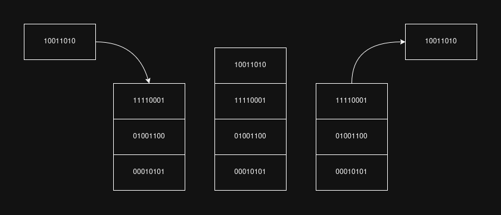
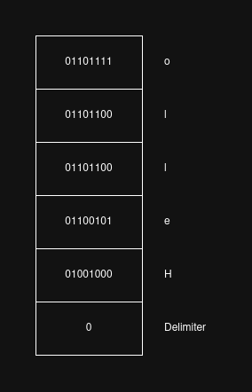

# Aglang reference

Aglang is a **stack-based, esoteric language** made to be simple, _like Assembly_.

_no AI was used while writing this document_

## Structure
The code is made up of **statements**, delimited by a `;` (semicolon), like, for example, Rust. The only exception to this rule are the **loops** (tokens `[` and `]`), which make up statements on their own.

Each statement follows this structure:
```
<arg1>[OPERATOR]<arg2>;
```
but not every operator needs two arguments; some require one, and some don't require any. Operations can't be chained in one statement, each one requires its own statement.

The following are all the valid tokens currently in Aglang:
- `;`
- `0`
- `1`
- `'`
- `''` (or `"`)
- `:`
- `[`
- `]`
- `\`
- `\#`
- `>`
- `!`
- `|`
- `+`
- `-`
- `*`
- `/`
- `%`

and any text wrapped between two `$` symbols are comments and should be ignored, like any other character not contained in the list above.

## Operators

There are 8 operators in Aglang, of which 5 are for arithmetic operations.

Below is a table of each operator, its statement structure and a description of what it does.

| Operator | Name           | Structure       | Description                                                                                                                          |
|:--------:|----------------|-----------------|--------------------------------------------------------------------------------------------------------------------------------------|
|   `>`    | Copy           | `[src]>[dest];` | Copies the value in `[src]` into `[dest]`.                                                                                           |
|   `!`    | Remove         | `[dest]!;`      | Either clears (if `[dest]` is a register) or pops (if `[dest]` is the stack) a value.                                                |
|   `\|`   | Input          | `\|;`           | Pushes `0` to the stack (to act as a delimiter), gets an input from the StdIn, reverses it and pushes each character into the stack. |
|   `+`    | Sum            | `[dest]+[src];` | Sums the two arguments and puts the result in `[dest]`. If the sum is greater than 255, the result wraps to 0.                       |
|   `-`    | Subtraction    | `[dest]-[src];` | Subtracts the two arguments and puts the result in `[dest]`. If the result is less than 0, it wraps to 255.                          |
|   `*`    | Multiplication | `[dest]*[src];` | Multiplies the two arguments and puts the result in `[dest]`. If the result is greater than 255, the result wraps to 0.              |
|   `/`    | Division       | `[dest]/[src];` | Divides the `[dest]` argument by `[src]` and puts the quotient in `[dest]`.                                                          |
|   `%`    | Remainder      | `[dest]%[src];` | Divides `[dest]` by `[src]` and puts the remainder of the operation in `[dest]`.                                                     |


## Memory

There are two ways to store data in Aglang: the **stack** and the **two available 8-bit registers**.

### Stack

The stack is a _LIFO_ array of 8-bit values.

The only value that can be read with the _copy_ operator (`:>[dest];`) is the one at the top: to access the ones below, the top value must first be **popped** with the _remove_ operator (`:!;`).

The top value of the stack cannot be directly written, so no arithmetic operations can be done on it. It first needs to be copied to a register, be popped and the new value needs to be copied from the register into the stack.



### Registers

In Aglang, you have two **8-bit registers**: R0 (`'` token) and R1 (`''` or `"` token, but the two single-quotes syntax is generally preferred). These two can be used to do arithmetic operations, and could be compared to _variables_ in other languages.

## I/O

### Output

In Aglang, data can be printed to the terminal in two ways:
- **ASCII value (`\`):** the most common, this prints the given value as its matching ASCII character: for example, moving the number 01000001 (65 in binary) into this output would print `A` into the console.
- **Number value (`\#`):** with this, the actual **decimal number** of the given value is printed: using the previous example, moving 01000001 into this second output would print `65` to the console.

To print a value, this being either a **register**, the **top value from the stack** or a **binary literal**, the _copy_ operator is used: `01000001>\;`.

### Input

To get an input from the user, the _input_ (`|`) operator is used.

This will do the following actions:
1. Push `0` into the stack, to act as a delimiter;
2. Wait for the user to input something in the console and press enter;
3. Push the reversed input into the stack (stripping the newline).

So, for example, if the user inputs `Hello`, the stack would look like this:



---

**You're set! Now that you've learned the basics, go write some Aglang!**
